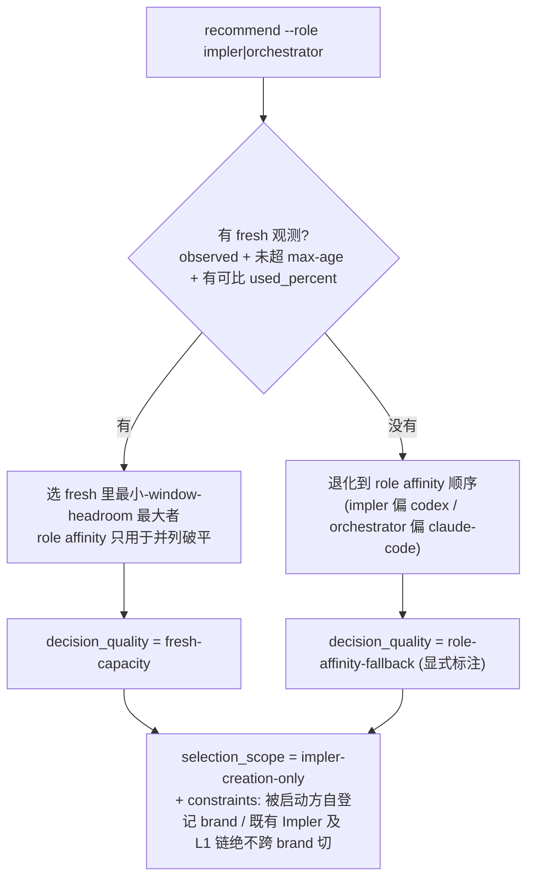

# 安全启动 AgentTUI + brand-capacity observer（阐释）

> 阐释层。规范本体在 [`overlay/spec/guides/agenttui-launch-and-brand-capacity.md`](../../overlay/spec/guides/agenttui-launch-and-brand-capacity.md)，决策在 [ADR-0008](../../overlay/spec/guides/decisions/0008-brand-capacity-and-safe-launch.md)。本页只把两个机制展开讲透（走查 + 决策流 + 为什么），冲突时以规范为准。

## 一句话

两件事共享同一底座:**启动器只选「启动哪个 CLI 二进制」,被启动会话自己登记「我实际是什么 brand」**。启动侧要把新会话安全落到一个确定的 pane;容量侧要在建新 Impler 前诚实地告诉你「哪个 brand 还有余量」——而「诚实」是这里最难的部分。

## 为什么需要它

同一台机器现在跑着多个并发 AgentTUI。两个反复踩的坑:

1. **启动踩焦点 pane**:往「当前焦点 pane」打字启动/引导新会话,焦点一飘就打到别人窗口,或让子会话继承了父会话的身份(`TRELLIS_CONTEXT_ID`),路由全乱。
2. **容量靠猜**:看到一个 `used_percent` 数字就当「余量」用——但它可能是**别的账户**的、**几小时前**被动落盘的、甚至根本是 cost/burn 这类**不是余量**的派生值。据此选 brand,系统性选错。

## 启动走查(guide §1 的时间线)

```
1. 一 tab 一 ATUI          每个 zellij tab 只放一个会话,避免同 tab 身份/焦点混淆
2. new-tab 原子启动 + 清父身份
     zellij new-tab -- env -u TRELLIS_CONTEXT_ID <claude|codex>
   ↑ 用 tab 的「初始命令」直接起 CLI(不是先开 pane 再打字);
     -u 清掉继承的 session-context 身份 → 子会话自建身份
3. resolve 稳定 pane        zellij action list-panes --json --all
     按 tab_name+cwd+command 定位真实 terminal_<N>(排除插件 pane);
     多候选/冲突/无匹配 → fail closed,停下人工确认,绝不猜
4. 定向 bootstrap          所有引导写 write-chars --pane-id terminal_<N>(绝不写焦点 pane)
5. 被启动方自登记          它自己写 spec.json.brand + runtime.pane_ref;启动器绝不代写
```

第 5 步是和 [ADR-0006](../../overlay/spec/guides/decisions/0006-runtime-brand-is-routing-authority.md) 的接点:**actual runtime brand 是路由唯一权威**。启动器代写 brand = 声明与实际脱钩,所以它只能选二进制、不能替对方声明身份。

> 和 [agenttui-registry §3 投递契约](../../overlay/spec/guides/agenttui-registry.md) 的关系:那边是往**已存在**的活会话注入字节;这边是安全**起一个新**会话。两侧共用同一个 pane 定向原语(`--pane-id`),是一对启动侧/送达侧姊妹。

## 容量的「诚实」模型(guide §2)

observer 是**单写者、纯 stdlib、无网络、不碰凭证**的本地进程。核心不是「读到数字」,而是**每条观测都带出处和新鲜度,拿不准就显式说不知道**:

| 字段 | 含义 | 为什么重要 |
|---|---|---|
| `source` | `polled` / `self-reported` / `unavailable` | 区分「我主动拉到的」「会话自己报的」「没有」 |
| `observed_at` | 观测时刻(可为 null) | `null` 永远不能当 fresh headroom |
| `status` | `observed` / `unknown` | unknown 是一等公民,不伪装成有数据 |

三个 brand 各自怎么来:

- **Codex** — 只读扫本地 `rollout-*.jsonl` 里服务端给的 `rate_limits`。值是权威的,但**被动落盘**,可能几小时前的 → 靠 `observed_at` + `--max-age-seconds` 判陈旧。
- **Claude Code** — 机械跑 `claude -p /usage --output-format json`(见下)。
- **谁都没有** → `unknown` / `unavailable`,`recommend` 绝不会选它当 fresh。

### Claude Code collector 为什么要「采信门」

`claude -p /usage` 是个**外部随时能拉**的机械查询(不需要有活跃会话在跑),它借本机 CLI 的登录态跑内置命令,但**不碰 token**。问题是:怎么确定这次调用**没真花钱跑一轮模型**、返回的是**用量**而不是别的?——采信门:

```
is_error == false  且  subtype == "success"        ← 命令真成功
num_turns == 0     且  total_cost_usd == 0          ← 零副作用证明:没跑 model turn
result 里命中 "Current session: N% used" / "Current week ..." ← 真是用量行
—— 任一不满足 → fail closed,该 brand 回退 unknown,不落任何 headroom
```

`observed_at` 记的是**你调用的时刻**(查询新鲜度),**不是**服务端生成数字的时刻——Claude 内部有 `cachedUsageUtilization`,没证据说每次 `/usage` 都绕缓存做服务器往返。所以 Claude 的「新鲜」保证天生比 Codex 弱一档,这是明写的取舍。

## recommend 决策流(仅建新 Impler 时)



关键:推荐**只在建新 Impler 前合法**。运行中的 Impler 容量耗尽,不是「把它切到别的 brand」,而是**停下、handoff 给一个新建的 Impler**——因为同一条 L1 链跨 brand 切会破坏 same-brand 链约束。

## observer 绝不做的事(边界)

不启停会话、不改 agent 注册、不代写 brand、不做不可逆调度、不读/存/打印凭证。多账户共享 `~/.codex/sessions` 时它**不区分账户**(取全局最新),所以跨账户场景**必须人工判定**——这是文档化的已知局限,不是自动兜底。把 observer 定成「观测者而非执行者」,是为了它能安全地随时跑。
